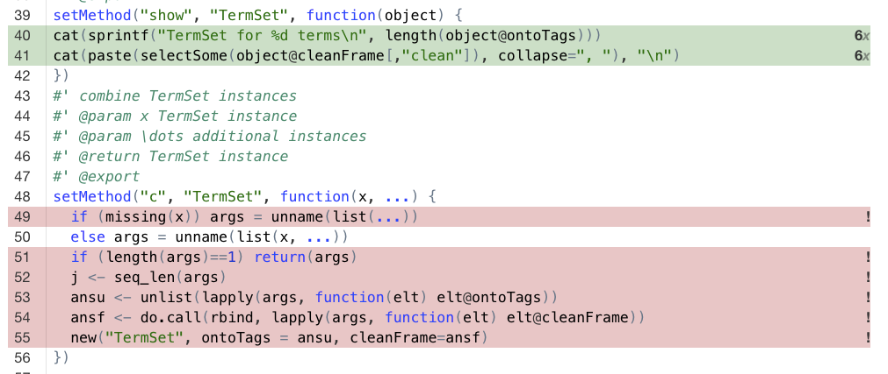
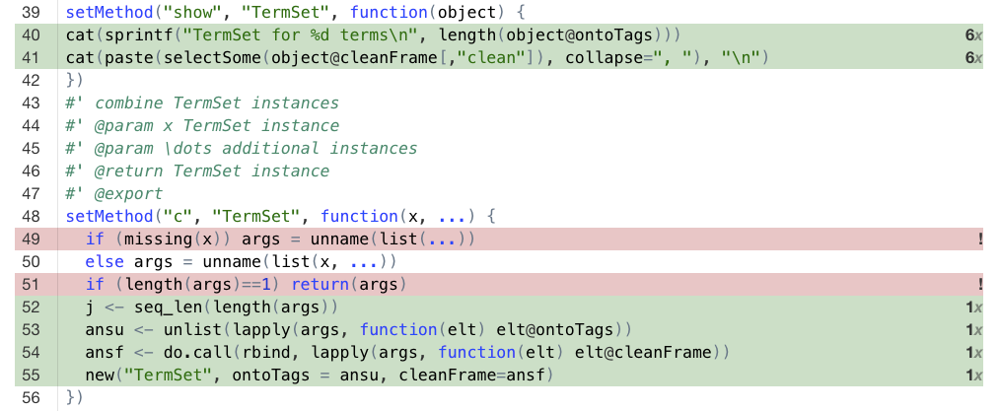
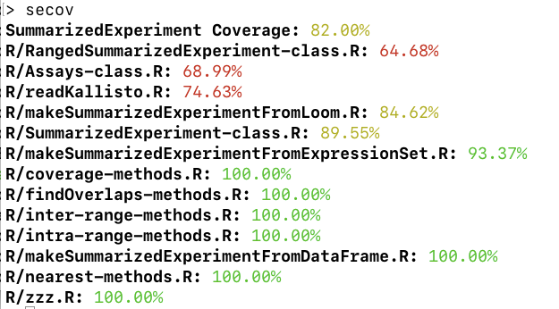
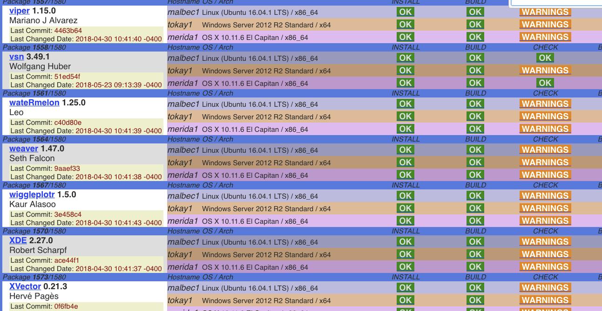

```{r setup,echo=FALSE,include=FALSE}
suppressPackageStartupMessages({
library(BiocStyle)
library(covr)
})
```

# Introduction

The package `groupAct2018` is created to help structure
group activities at the Bioconductor 2018 Developer Day.

Ideally, three areas of development activity would
be addressed.  We have not had time to structure work
on performance enhancement

- Reliability enhancement through improved test coverage for Bioconductor packages
- Standards compliance through elimination of conditions raising warnings
- Performance enhancement through profiling, bottleneck reduction,
and improving use of available computational resources

Other general areas should be identified for future group activities.

# Assessing and improving test coverage

## Background

### Using covr

The `r CRANpkg("covr")` package measures the
degree to which formal or informal tests provided
in package code actually exercise code elements.

As an example we ran `r CRANpkg("covr")` 3.1.0 on `r Biocpkg("ontoProc")` 
1.3.3.  The call `package_coverage(type="all")` was run in 
the root of the package source folder.  This generates
an object that can be inspected using `covr::report`.  

An example of
a `covr` finding of interest is



Note that lines 51 through 55 are shaded pink with exclamation
points on the right.  This indicates absence of testing for these
lines.  On the other hand, lines 40 and 41 are green and have `6x`
on the right, indicating that various testing elements such
as examples, vignette code, and formal test code exercise these
lines of code.

Upon adding the test

```
test_that("concatenation works", {
  efoOnto = getEFOOnto()
  defsibs = siblings_TAG("EFO:1001209", efoOnto)
  conc = c(defsibs, defsibs)
  expect_true(length(conc@ontoTags)==8)
})
```

to `tests/testthat/testAll.R`, we have



We now have some protection against silent package degradation
through changes that affect several processes related to
TermSet concatenation.  The counts of tests for functionality
of `getEFOOnto` and `siblings_TAG` should increase, and
now the concatenation method is explicitly tested.

We should not be using the at-sign.  This coding deficiency should
be picked up in BiocCheck or R CMD check.

### Some related results provided in the groupAct2018 package

Measuring test coverage can take considerable time
in complex packages.  We have run `package_coverage` on
a number of prominent packages and we provide the results
in `groupAct2018`.
```{r lklk}
library(groupAct2018)
dir(system.file("coverageObjs", package="groupAct2018"))
ls("package:groupAct2018") # hints
secov = getSEcoverage()
```
The print method does not render nicely in HTML; you'll see
something like this when printing `secov`.



## Activity

- Review the coverage statistics for the packages summarized
in `groupAct2018`.  Establish some priorities for enhancing
the test coverage.
- Define new tests for the high priority functionalities
and demonstrate that coverage is improved.
- Contribute the new tests to the target packages.

# Discovering and fixing warnings in Bioconductor packages

## Background

Here is a slice of the devel branch build report,
subset to focus on packages that exhibit warnings.



## Activities

### The basic tasks

- Define priorities for revising packages to eliminate
conditions that raise warnings.
- Complete the revisions and demonstrate that warnings
are eliminated and CMD check results are improved.
- Submit the revisions to the package maintainers.

### Advanced: improving C interface code in `r Biocpkg("BitSeq")`

We have fixed on the BitSeq package because its warnings
concern aspects of interfacing to C.  Undoubtedly there
are other packages raising similar conditions.  Understanding
how to repair these will be useful in other contexts.

The build report for `r Biocpkg("BitSeq")` has remarks about
C code and directory handling.  Modify the package sources
to eliminate the conditions provoking these messages.
```
Note: information on .o files is not available
File ‘/home/biocbuild/bbs-3.8-bioc/R/library/BitSeq/libs/BitSeq.so’:
  Found ‘puts’, possibly from ‘printf’ (C), ‘puts’ (C)
  Found ‘rand’, possibly from ‘rand’ (C)
  Found ‘stderr’, possibly from ‘stderr’ (C)
  Found ‘stdout’, possibly from ‘stdout’ (C)

Compiled code should not call entry points which might terminate R nor
write to stdout/stderr instead of to the console, nor use Fortran I/O
nor system RNGs. The detected symbols are linked into the code but
might come from libraries and not actually be called.

See ‘Writing portable packages’ in the ‘Writing R Extensions’ manual.
* checking files in ‘vignettes’ ... OK
* checking examples ... WARNING
Found the following significant warnings:
  Warning: working directory was changed to ‘/home/biocbuild/bbs-3.8-bioc/R/library/BitSeq/extdata’, resetting
```

### Advanced: meta-repair for inter-language interfaces

Specify and implement a tool that surveys the Bioconductor sources
or build report
results and catalogues issues (like entry points that
might terminate) with C and other
foreign language interfaces used in Bioconductor
packages.  The `r Biocpkg("BiocPkgTools")`
package may be of use.


# Profiling mission-critical code
